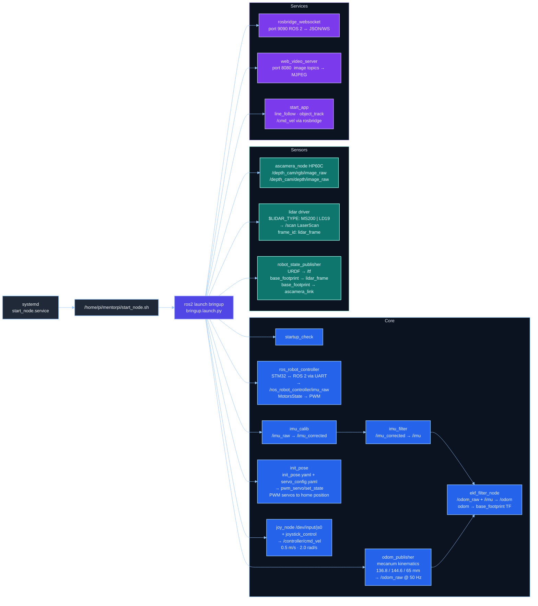

# MentorPi Bringup Reference

Detailed boot sequence and confirmed runtime graph produced by `bringup.launch.py`.

For the broader system architecture and package map see [mentorpi-ros-architecture.md](mentorpi-ros-architecture.md).

---

## Boot sequence

```
power on
  └─ Raspberry Pi OS boots (systemd)
       └─ docker.service starts
            └─ start_node.service  [/etc/systemd/system/start_node.service]
                 │  After=docker.service, User=pi, Type=simple, Restart=no
                 └─ /home/pi/mentorpi/start_node.sh
                      └─ [inside MentorPi Docker container]
                           └─ ros2 launch bringup bringup.launch.py
```

Verify on the robot:

```bash
systemctl is-enabled start_node.service   # → enabled
systemctl status start_node.service
cat /home/pi/mentorpi/start_node.sh
```

---

## Bringup fan-out diagram



---

## Node reference

### Core — motion and state

These nodes must all be running for the robot to move and publish state.
If any Core node crashes, the chassis stops responding to commands.

| Node | Package | Subscribes | Publishes |
|---|---|---|---|
| `startup_check` | `bringup` | — | logs only |
| `ros_robot_controller` | `ros_robot_controller` | `ros_robot_controller/set_motor` (`MotorsState`) | `/ros_robot_controller/imu_raw` (`Imu`) |
| `odom_publisher` | `controller` | `controller/cmd_vel` (`Twist`) | `/odom_raw` (`Odometry`) |
| `imu_calib` | `imu_calib` | `/ros_robot_controller/imu_raw` | `/imu_corrected` (`Imu`) |
| `imu_filter` | `imu_complementary_filter` | `/imu_corrected` | `/imu` (`Imu`) |
| `ekf_filter_node` | `robot_localization` | `/odom_raw`, `/imu` | `/odom` (`Odometry`), `odom→base_footprint` TF |
| `init_pose` | `controller` | — | `ros_robot_controller/pwm_servo/set_state` (`SetPWMServoState`) |
| `joy_node` | `joy` | `/dev/input/js0` | `sensor_msgs/Joy` |
| `joystick_control` | `peripherals` | `sensor_msgs/Joy` | `/controller/cmd_vel` (`Twist`) |

Key parameters:
- mecanum model: wheelbase 136.8 mm, track width 144.6 mm, wheel diameter 65 mm
- joystick limits: linear max 0.5 m/s, angular max 2.0 rad/s
- `imu_filter` launch delay: 5 s (waits for `imu_calib` to stabilise)

### Sensors — perception

These nodes publish data from physical hardware.
If a sensor node crashes, the robot continues driving but loses spatial awareness.

| Node | Package | Publishes | TF frame |
|---|---|---|---|
| `ascamera_node` | `ascamera` | `/depth_cam/rgb/image_raw`, `/depth_cam/depth/image_raw`, `camera_info` | `ascamera_camera_link_0` |
| lidar driver | `peripherals` (wraps MS200 or LD19) | `/scan` (`LaserScan`) | `lidar_frame` |
| `robot_state_publisher` | `robot_state_publisher` | `/tf` static transforms | — |

Static TF published by `robot_state_publisher`:
- `base_footprint → lidar_frame`
- `base_footprint → ascamera_camera_link_0`

Lidar type is set by the `$LIDAR_TYPE` environment variable at container start (`MS200` or `LD19`).

### Services — remote access and app scenarios

These components can be stopped independently without affecting chassis control.

| Component | Protocol | Port | Purpose |
|---|---|---|---|
| `rosbridge_websocket` | JSON over WebSocket | 9090 | Exposes all ROS 2 topics and services to the mobile app and any browser client |
| `web_video_server` | MJPEG over HTTP | 8080 | Streams image topics; access via `http://<robot-ip>:8080/stream?topic=<topic>` |
| `start_app` nodes | ROS 2 | — | Line following, object tracking, and other scenario behaviours; receive commands via rosbridge, publish `/cmd_vel` |

---

## Confirmed minimum topic set after bringup

```bash
# Odometry pipeline
/ros_robot_controller/imu_raw   # raw IMU from STM32
/imu_corrected                  # after imu_calib
/imu                            # after imu_filter (complementary)
/odom_raw                       # mecanum kinematics only
/odom                           # EKF-fused, used by SLAM and navigation

# Servo initialisation
ros_robot_controller/pwm_servo/set_state  # PWM servos to home position (init_pose)

# Motion control
/controller/cmd_vel             # Twist from joystick or app
/ros_robot_controller/set_motor # MotorsState to STM32

# Sensors
/scan                           # LaserScan from lidar
/depth_cam/rgb/image_raw        # colour frames from HP60C
/depth_cam/depth/image_raw      # depth frames from HP60C

# Coordinate frames
/tf                             # odom→base_footprint, base_footprint→lidar_frame, etc.
/tf_static                      # base_footprint→ascamera_camera_link_0

# Remote access
rosbridge on port 9090
web_video_server on port 8080
```

---

## Quick verification commands

Run these from an external PC or the robot container to confirm bringup health.

```bash
# Node presence
ros2 node list | grep -E "ros_robot_controller|odom_publisher|ekf_filter|joy_node|joystick_control|ascamera|startup_check"

# Topic rates
ros2 topic hz /odom_raw    # expect ~50 Hz
ros2 topic hz /odom        # expect ~50 Hz
ros2 topic hz /scan        # expect ~10–15 Hz

# IMU pipeline
ros2 topic echo /ros_robot_controller/imu_raw --once
ros2 topic echo /imu --once

# TF tree (requires tf2_tools)
ros2 run tf2_tools view_frames

# Camera stream in browser
# http://<robot-ip>:8080
```
