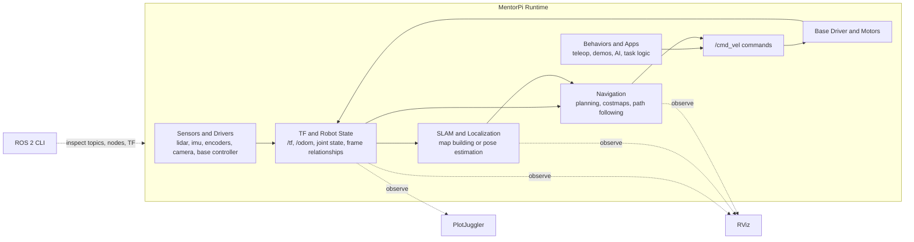
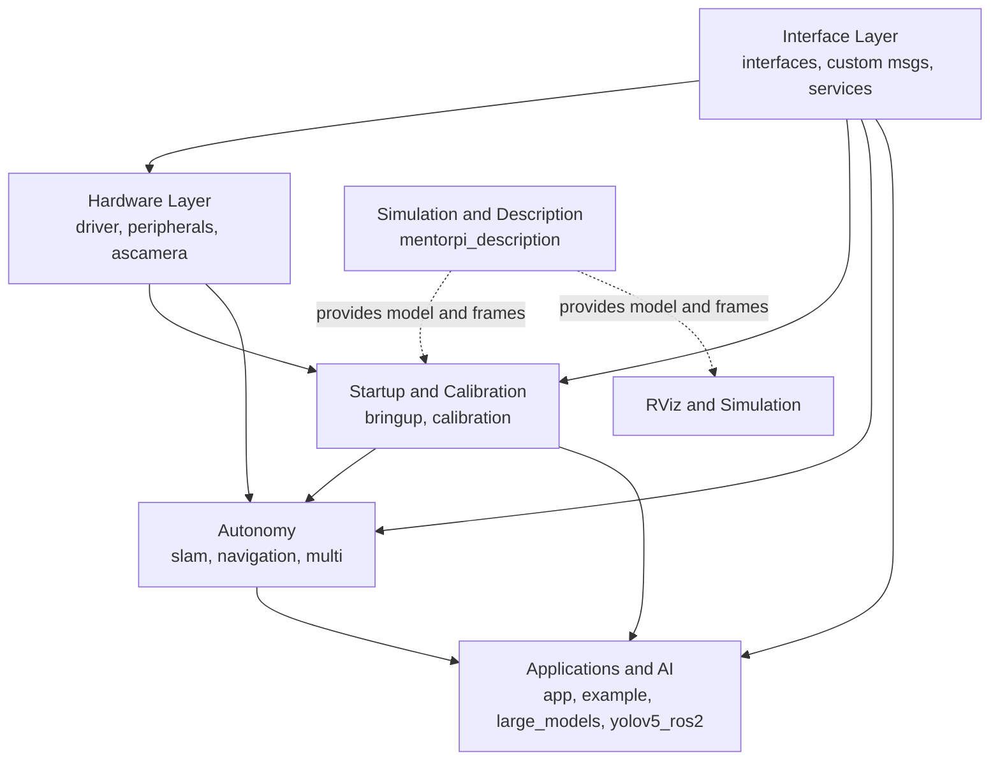
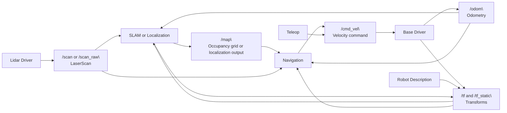
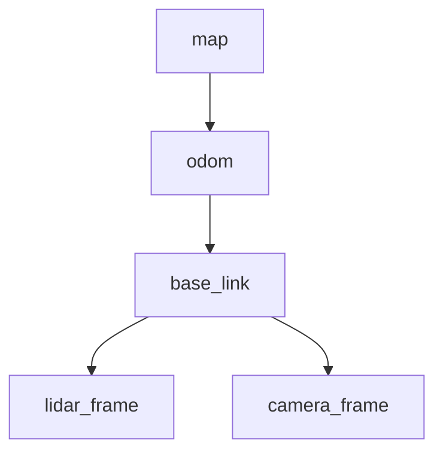

# MentorPi ROS System Architecture

This document is the workspace-level architecture reference for MentorPi ROS 2 packages.

It is intended to help a newcomer build a practical mental model of how MentorPi works end-to-end: hardware drivers produce robot state and sensor data, TF connects those data streams into a shared coordinate story, SLAM and navigation use that shared state to reason about the world, and behavior packages turn goals into visible robot actions.

When topic names, node names, or frame IDs are mentioned below, treat them as typical or expected examples unless they are explicitly confirmed in your running system. On a live robot, always verify with `ros2 topic list`, `ros2 node list`, and TF inspection in RViz.

## 1. High-level view

MentorPi is organized as layered ROS 2 subsystems:

1. hardware and sensors
2. shared interfaces
3. startup and calibration
4. autonomy (SLAM/navigation/multi)
5. application and AI behaviors
6. simulation/description

Typical runtime flow:

1. hardware drivers publish base state and sensors
2. interface packages define shared messages/services
3. bringup launches baseline robot runtime
4. autonomy packages consume state + sensor data
5. app/example/AI packages implement visible behaviors

What this means in practice:

- When you turn the robot on, the lowest layer comes alive first. The base controller, IMU, lidar, camera, and any other attached devices begin publishing ROS messages and TF transforms that describe what the robot senses and where its parts are in space.
- The bringup layer then assembles those publishers into a usable runtime graph. That usually means starting base-state publishers, teleop or input nodes, sensor wrappers, and any launch-time parameterization needed for calibration.
- Once the robot is producing a stable odometry and TF tree, higher-level packages such as SLAM and navigation can attach to that state and start reasoning about the map, localization, and path execution.
- Finally, behavior packages consume those autonomy outputs or raw perception streams and decide what the robot should do next.

What happens when you drive it with a joystick:

1. a teleop or input node reads joystick events
2. it publishes a velocity command, typically on a topic such as `/cmd_vel`
3. the base driver consumes that command and sends motor-level instructions to the controller board
4. wheel motion produces fresh odometry and TF updates, typically around `/odom` and `/tf`
5. SLAM, navigation, RViz, and logging tools observe those updates to track robot motion

This is the main control loop viewers should keep in mind: commands go down toward the base driver, while state and sensor observations flow up toward localization, planning, and visualization.



## Glossary

- `cmd_vel`: the standard ROS velocity-command topic shape, usually a `geometry_msgs/Twist`. It tells the robot how fast to move forward, sideways if supported, and how fast to rotate.
- odometry: the robot's estimate of its own motion over short time spans, often derived from wheel encoders, IMU fusion, or both. Odometry is locally useful but drifts over time.
- TF: the ROS transform system. TF answers questions like "where is the lidar relative to the robot base" or "where is the robot base relative to odom right now."
- `LaserScan`: a common ROS message for 2D lidar ranges, often published on topics such as `/scan` or `/scan_raw`.
- SLAM: simultaneous localization and mapping. A SLAM package estimates the robot pose while building or updating a map.
- Nav2: the ROS 2 navigation stack. It usually handles path planning, costmaps, recovery behavior, and path execution.
- costmap: a grid representation of nearby obstacles and traversability used by planners and controllers.
- `odom` frame: a locally smooth frame used for short-term motion tracking. It should not jump suddenly, but it can drift relative to the world.
- `map` frame: a world-referenced frame used by SLAM or localization. It provides long-term global consistency and may correct drift relative to `odom`.
- `base_link`: the conventional frame attached to the robot body, used as the main reference for robot motion and attached sensors.

## 2. Package map

Core package groups in this workspace:

- Hardware layer:
  - `src/MentorPi/driver`
  - `src/MentorPi/peripherals`
  - `src/ascamera`
- Interface layer:
  - `src/MentorPi/interfaces`
  - `src/MentorPi/driver/ros_robot_controller_msgs`
  - `src/MentorPi/large_models_msgs`
- Startup and calibration:
  - `src/MentorPi/bringup`
  - `src/MentorPi/calibration`
- Autonomy:
  - `src/MentorPi/slam`
  - `src/MentorPi/navigation`
  - `src/MentorPi/multi`
- Applications and AI:
  - `src/MentorPi/app`
  - `src/MentorPi/example`
  - `src/MentorPi/large_models`
  - `src/MentorPi/yolov5_ros2`
- Simulation/model:
  - `src/MentorPi/simulations/mentorpi_description`

How to read this package map:

- Hardware layer: these packages touch physical devices or their vendor integrations. In the runtime graph, they are close to the actual robot and usually publish the first useful state and sensor topics.
- Interface layer: these packages define contracts between subsystems. They matter because many runtime dependencies are not direct code imports but shared message and service types.
- Startup and calibration: these packages decide what gets launched together and how the robot is tuned. They often do not publish the most interesting data themselves, but they determine whether the rest of the graph is wired correctly.
- Autonomy: these packages turn raw robot state into higher-level world understanding and goal-directed motion.
- Applications and AI: these packages are where visible behaviors, demos, and task logic usually live.
- Simulation/model: these packages help describe the robot shape, joints, and frames for RViz and simulation workflows.

You can think of the runtime graph as a stack: lower packages publish the facts, middle packages interpret them, and upper packages decide what to do with them.



## 3. Responsibilities by major package

### driver

Low-level robot control and bridge to controller board.

- `controller`: Python-side control workflows
- `ros_robot_controller`: ROS interface runtime
- `ros_robot_controller_msgs`: custom messages/services
- `sdk`: helper SDK components

What it provides:

- The `driver` area is where ROS commands are translated into hardware actions and hardware feedback is translated back into ROS messages.
- It is the closest software layer to the motor controller and other core robot electronics.

Typical nodes, topics, and interfaces:

- Typical or expected examples include command subscribers such as `/cmd_vel`, odometry publishers such as `/odom`, and TF publishers that connect robot frames into the rest of the graph.
- It may also expose custom services or messages through `ros_robot_controller_msgs` for controller-specific capabilities.

How it connects to other packages:

- `bringup` usually launches the driver-side runtime.
- `navigation`, `app`, and teleop flows depend on the driver accepting velocity commands.
- RViz and PlotJuggler help verify that odometry and state feedback are being published at a steady rate.

How to verify:

- Check `ros2 node list` for controller-related nodes.
- Check `ros2 topic list` for expected state and command topics.
- Use `ros2 topic echo` or PlotJuggler to confirm odometry is changing when the robot moves.

### peripherals

External devices and operator input.

- joystick and keyboard teleop
- IMU and filtering helpers
- camera and lidar launch wrappers

What it provides:

- `peripherals` connects the robot to operator input devices and common external sensors.
- It is often the package group that turns raw accessories into ROS-friendly streams.

Typical nodes, topics, and interfaces:

- Typical or expected examples include joystick input, teleop command publication, IMU topics, lidar scans such as `/scan`, and camera image topics.
- If filtering or republishing is involved, this package may also publish cleaned or remapped sensor topics.

How it connects to other packages:

- Teleop flows feed into the base command path, usually through `/cmd_vel`.
- Sensor outputs feed into `slam`, `navigation`, `app`, `example`, or external visualization tools.

How to verify:

- Use `ros2 topic list` to confirm joystick, IMU, lidar, or camera topics are present.
- Use `ros2 topic hz /scan` or the appropriate scan topic to confirm sensor activity.
- In RViz, confirm that scan data appears in the correct place relative to the robot.

### ascamera

Vendor depth-camera package (Ascamera/HP60 family).

- C++ node and launch files
- vendor libraries
- configuration files

What it provides:

- `ascamera` is a vendor integration package for the HP60/Ascamera family, including the camera node implementation, launch files, vendor libraries, and sensor-specific configuration.
- It is the most hardware-specific perception package in this workspace.

Typical nodes, topics, and interfaces:

- Typical or expected examples include image topics, depth topics, camera info topics, and a TF frame for the camera body or optical frame.
- Exact topic names and frame IDs depend on the launch file and camera model, so confirm them on the live system.

How it connects to other packages:

- Perception-driven applications, AI pipelines, and RViz visualizations consume the camera outputs.
- If camera data is fused with other sensors, those downstream packages also rely on its TF relationship to `base_link`.

How to verify:

- Run `ros2 topic list | grep image` or inspect the topic graph manually.
- In RViz, confirm that camera data appears and the camera frame is attached to the expected TF tree.

### bringup

System startup composition and baseline runtime orchestration.

What it provides:

- `bringup` collects the packages required for a normal robot session and launches them in a coherent order.
- It is where a user typically starts when they want the robot to behave like a complete system instead of a set of isolated nodes.

Typical nodes, topics, and interfaces:

- `bringup` often does not define the most recognizable topics itself; instead, it assembles launch-time configuration for base drivers, sensors, teleop, robot description, and sometimes autonomy.

How it connects to other packages:

- It depends on `driver`, `peripherals`, and interface packages, then creates the baseline that `slam`, `navigation`, and application packages assume exists.

How to verify:

- After launch, `ros2 node list` should show a connected graph rather than isolated nodes.
- In RViz, TF should form a connected tree rather than disconnected frame islands.

### calibration

Linear/angular calibration and tuning tools.

What it provides:

- `calibration` helps make commanded motion match physical motion more accurately.
- This matters because both SLAM and navigation become unreliable if the robot consistently over-rotates, under-rotates, or reports bad odometry.

Typical nodes, topics, and interfaces:

- Typical or expected examples include tools that compare commanded motion versus observed motion using odometry, IMU, or operator measurements.

How it connects to other packages:

- Better calibration improves `driver` outputs, which directly improves `slam`, `navigation`, and teleop behavior.

How to verify:

- Drive a simple straight line or rotate-in-place test and compare commanded versus observed movement.
- Plot odometry and IMU signals to check for obvious scaling or bias problems.

### slam

Mapping and localization workflows (including RViz helpers).

What it provides:

- `slam` packages estimate where the robot is while building or refining a map.
- For a beginner, the key idea is that SLAM sits above raw odometry: it watches sensor data and uses it to correct the robot's long-term world estimate.

Typical nodes, topics, and interfaces:

- Typical or expected examples include lidar scan subscriptions such as `/scan`, odometry or TF inputs, a map topic such as `/map`, and a `map -> odom` transform.

How it connects to other packages:

- `slam` consumes state from `driver` and `peripherals` and produces global context that `navigation` and RViz rely on.
- If `slam` is not running, the robot may still drive, but global mapping and map-based planning will be limited or unavailable.

What this means for `odom` vs `map`:

- `odom` is your short-term motion estimate. It should change smoothly and continuously as the robot moves.
- `map` is your corrected world reference. SLAM or localization is responsible for keeping the robot aligned to it.
- The transform `map -> odom` is the bridge between those two ideas: it corrects odometry drift without forcing the `odom` frame itself to jump every time the estimate improves.

How to verify:

- Confirm scan data exists and TF is connected from sensor frames back to the base.
- In RViz, verify that the map appears, updates, and remains consistent as the robot moves.
- Check whether a `map` frame and a `map -> odom` relationship exist in the TF tree.

### navigation

Goal-driven autonomous navigation and integration launches.

What it provides:

- `navigation` usually hosts the Nav2-style stack that takes a goal pose and turns it into safe motion commands.
- It plans where the robot should go, reasons about obstacles through costmaps, and publishes movement commands back to the base.

Typical nodes, topics, and interfaces:

- Typical or expected examples include goal inputs, local and global costmaps, planned paths, robot pose estimates, and velocity outputs such as `/cmd_vel`.
- Exact topic names vary, so validate them on the live system.

How it connects to other packages:

- `navigation` depends on `slam` or localization, a valid TF tree, and reliable odometry.
- It sends command outputs to the same lower-level base driver path used by teleop.

What this means in practice:

- Navigation does not replace the driver. It sits above it.
- Navigation also does not replace TF. It depends on TF to understand where the robot is, where obstacles are, and how to transform data between frames.

How to verify:

- In RViz, send a goal and confirm that a path appears and the robot pose updates correctly.
- Check that `/cmd_vel` is active while navigation is moving the robot.
- If planning fails, inspect whether `/map`, `/odom`, `/tf`, and scan topics are all present and consistent.

### multi

Multi-robot coordination, TF and follower workflows.

What it provides:

- `multi` supports workflows where more than one robot or robot namespace is active.
- It typically addresses duplicated topics, namespaced TF, and follow/coordination behavior.

Typical nodes, topics, and interfaces:

- Typical or expected examples include namespaced odometry, scan, TF, and command topics for each robot instance.

How it connects to other packages:

- It layers on top of the same base building blocks as single-robot bringup, but adds namespace and coordination logic.

How to verify:

- Check that each robot has distinct nodes, topics, and frame names or namespaces as intended.
- In RViz, verify that TF from one robot does not accidentally collide with another robot's frames.

### app/example

Task-level behaviors and demos.

What it provides:

- `app` and `example` are where users usually see visible robot behavior first.
- They contain task logic, demos, integration examples, and higher-level decision-making built on top of the lower stack.

Typical nodes, topics, and interfaces:

- Typical or expected examples include behavior nodes that subscribe to sensor, navigation, or detection outputs and then trigger actions, speech, movement, or UI responses.

How it connects to other packages:

- These packages sit above `driver`, `peripherals`, `slam`, `navigation`, or perception systems and orchestrate them into complete use cases.

How to verify:

- Start the behavior and confirm its required inputs exist first.
- Use `ros2 topic list` and RViz to check that the behavior's perception and motion dependencies are healthy before debugging the behavior logic itself.

### large_models and large_models_msgs

AI-driven behaviors and their interface contracts.

What it provides:

- `large_models` contains AI-oriented robot logic, while `large_models_msgs` defines the messages and services needed to connect that logic to the rest of the system.
- This split follows a common ROS pattern: keep interface contracts stable and reusable even if the behavior implementation changes.

Typical nodes, topics, and interfaces:

- Typical or expected examples include task request topics, AI result messages, or services for behavior triggering and response handling.

How it connects to other packages:

- These packages often consume perception, robot state, and application events, then produce behavior decisions or structured outputs for `app`-level consumers.

How to verify:

- Confirm that the required custom message packages are built and sourced.
- Use `ros2 interface list` and `ros2 topic info` to validate that publishers and subscribers agree on message types.

### yolov5_ros2

Object-detection integration and ROS topic publishing.

What it provides:

- `yolov5_ros2` connects an object-detection pipeline to ROS topics.
- It is usually part of the perception-to-behavior path rather than the base mobility path.

Typical nodes, topics, and interfaces:

- Typical or expected examples include image subscriptions, detection result topics, bounding boxes, or annotated image outputs.

How it connects to other packages:

- It depends on camera topics from `peripherals` or `ascamera` and can feed results into `app`, `example`, or AI behaviors.

How to verify:

- Confirm that image topics are alive before debugging detection.
- If detections are missing, inspect image transport, frame rate, and whether the model node is receiving the expected encoding and resolution.

### mentorpi_description

URDF/TF description for visualization and simulation usage.

What it provides:

- `mentorpi_description` describes the robot's geometry, links, joints, and static relationships.
- It is crucial for RViz because it gives shape and meaning to the TF tree.

Typical nodes, topics, and interfaces:

- Typical or expected examples include robot description parameters, joint state usage, and static transforms that connect sensors to `base_link`.

How it connects to other packages:

- `bringup`, RViz, simulation, and autonomy stacks all benefit from a correct robot description.
- If this layer is wrong, the robot may still publish data, but visual alignment and frame reasoning become confusing or incorrect.

How to verify:

- In RViz, confirm that the robot model aligns with scan and camera data.
- Check that frames such as `base_link`, lidar, and camera frames appear where you expect them.

### TF and topic flow mental model

TF is one of the most important ROS concepts for mobile robots, because it lets every subsystem speak about position using the same frame relationships.

- A lidar scan is only useful for SLAM or navigation if the system knows where the lidar is mounted.
- Odometry is only useful globally if the system knows how that short-term local motion estimate relates to the world map.
- Navigation can only generate safe commands if it can transform robot pose, obstacle data, and goals into compatible frames.



The exact names above may differ on your robot. The point of the diagram is conceptual: identify the scan source, odometry source, TF publishers, map producer, and command consumer, then verify that the data dependencies are connected on the live system.



This TF diagram is also conceptual. The exact frame IDs on MentorPi must be confirmed on the running robot by inspecting `/tf` in RViz or by using TF tools. What matters is the role of each link in the chain:

- `map -> odom`: global correction from SLAM or localization
- `odom -> base_link`: continuous local motion estimate from odometry
- `base_link -> sensor frame`: where each sensor is physically mounted on the robot

## 4. Integration patterns

Common system compositions:

1. base robot operation:
   - `bringup` + `driver` + `peripherals`
2. perception + behavior:
   - `peripherals` or `ascamera` + `app`/`example`/`yolov5_ros2`
3. autonomy:
   - `calibration` -> `slam` -> `navigation`
4. multi-robot:
   - baseline stack + `multi`

What to launch, what to expect, and how to verify:

1. base robot operation:
  - Runtime idea: start `bringup` with the core `driver` and `peripherals` stack.
  - What to expect: the robot should expose base state, TF, and operator-control paths even if SLAM and navigation are not running.
  - How to verify: confirm that expected nodes are present, `odom` is updating, and the TF tree connects the base to the active sensors. Use RViz for TF and PlotJuggler for odometry trends.
2. perception + behavior:
  - Runtime idea: launch the relevant sensor source first, then launch the consumer behavior or perception package.
  - What to expect: image or scan topics should appear before the higher-level app produces useful behavior.
  - How to verify: check sensor topic rates with `ros2 topic hz`, inspect the topic graph, and confirm the consuming node is subscribed to the expected inputs.
3. autonomy:
  - Runtime idea: calibrate enough that odometry is trustworthy, then start `slam`, then start `navigation` once map and TF look healthy.
  - What to expect: the robot should publish a map or localization result, expose a consistent `map -> odom -> base_link` chain, and begin accepting navigation goals.
  - How to verify: use RViz to display TF, scan, pose, and map together. If the map slides, scan floats away from the robot, or the goal pose behaves strangely, debug TF and odometry before blaming the planner.
4. multi-robot:
  - Runtime idea: start one clean single-robot stack first, then add `multi` coordination and namespacing.
  - What to expect: each robot should retain its own state, topics, and frame relationships without naming collisions.
  - How to verify: use `ros2 topic list` and RViz to confirm namespace separation and distinct TF trees or prefixed frames.

What this means for SLAM and navigation composition:

- SLAM answers: "Where am I, and what does the world look like?"
- Navigation answers: "Given where I am and where I want to go, what path and control command should I execute?"
- Both depend on lower layers being healthy. If the base driver, odometry, or sensor TF is broken, SLAM and navigation may both fail even though their own nodes are technically running.

## 5. Hardware dependency categories

- Mostly hardware-required:
  - `driver`, `bringup`, many `app` and motion-centric examples
- Hardware-optional with substitutions:
  - `peripherals` camera flows via USB webcam
  - selected image-only `example` nodes
  - `yolov5_ros2` on webcam/image topics
- PC-only friendly:
  - `mentorpi_description` visualization
  - ROS graph/topic debugging

What can be done in Docker or on an external PC without the robot:

- You can read the code, inspect launch structure, build interface packages, review message definitions, and prepare RViz or analysis workflows.
- You can often run visualization-oriented pieces such as robot description displays, provided the needed ROS packages are installed locally.
- You can attach to a live robot remotely from another PC to inspect topics, TF, maps, and timing without running the heavy GUI tools directly on the robot.

What usually cannot be validated without real hardware or a live publisher:

- Base motion accuracy, real odometry quality, lidar scan health, IMU behavior, and camera-driver correctness all depend on actual devices or a high-fidelity simulator.
- Any package whose main job is to convert real sensor or controller traffic into ROS messages is only partially testable without the matching hardware.

Practical rule:

- If the package controls motors or wraps a physical sensor, expect only partial confidence without the robot.
- If the package consumes already-published ROS topics, an external PC or Docker workflow is often enough to inspect and debug it.

## 6. Development recommendation

When adding new functionality, place it in the highest valid layer:

- hardware specifics in driver/peripherals/ascamera
- cross-package messages in interfaces packages
- behavior logic in app/example
- autonomy logic in slam/navigation/multi

This keeps dependencies clean and helps maintain testability without full robot hardware.

Concrete examples:

- A new teleop input node that converts a custom joystick or web UI into velocity commands belongs in `peripherals` if it is mainly an input/device integration.
- A new perception pipeline that consumes camera images and publishes detections belongs in `app`, `example`, or a perception-focused package, while any new reusable message definitions belong in an interface package.
- A new map-aware behavior such as "drive to docking pose" belongs above raw navigation, usually in `app` or another behavior package, unless it changes the planner or controller itself.
- A new multi-robot follower strategy belongs in `multi` because it depends on namespaced robot relationships rather than single-robot hardware access.

Design rule of thumb:

- Put hardware-specific code as low as possible.
- Put reusable contracts in interfaces.
- Put user-visible decisions and task logic as high as possible.

That separation makes it easier to test parts of the system independently and easier to observe problems from an external PC.

## 7. Validation checklist (external PC)

Use this as a quick live-system checklist during the entry-video workflow or any remote debugging session.

1. Discovery

```bash
ros2 node list
ros2 topic list
```

Confirm that the expected driver, sensor, SLAM, or navigation nodes are visible from the external PC.

2. Sensor sanity

```bash
ros2 topic hz /scan
ros2 topic echo /odom
```

If your robot uses different topic names, substitute the live names you found with `ros2 topic list`.

3. TF and robot model

- Open RViz and display TF, RobotModel, LaserScan, and Map.
- Confirm that the TF tree is connected and that scan data sits in the right place relative to the robot body.
- Confirm that the `map -> odom -> base_link` chain exists conceptually, even if your actual frame IDs differ.

4. Motion and estimation

```bash
ros2 topic hz /odom
```

- Use PlotJuggler to inspect odometry and IMU trends over time.
- Drive the robot slowly and check that odometry direction, rotation, and rate look physically plausible.

5. Mapping and navigation

- In RViz, verify that map, scan, and pose remain aligned while the robot moves.
- If navigation is active, confirm that goals produce planned paths and outgoing velocity commands.

6. If something is wrong, reduce the stack

- First verify topics and TF from `driver` and `peripherals`.
- Then verify `slam` or localization.
- Only then debug `navigation` or higher-level behaviors.

That bottom-up order matches the real dependency chain and usually finds the root cause faster than debugging the highest-level package first.