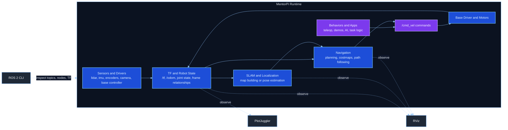
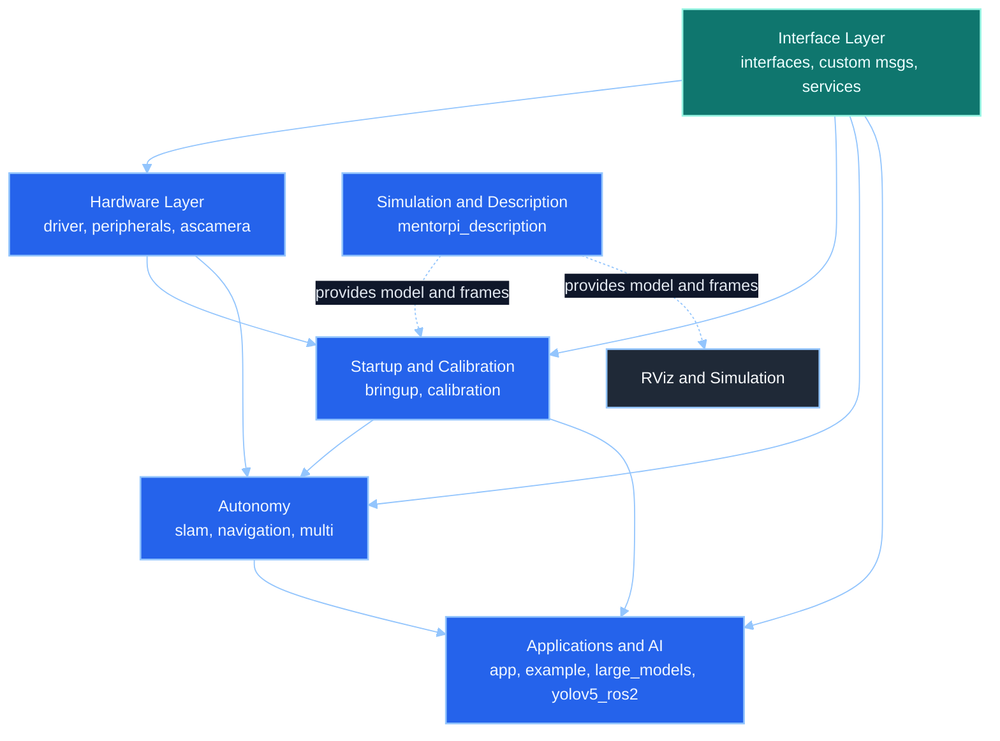
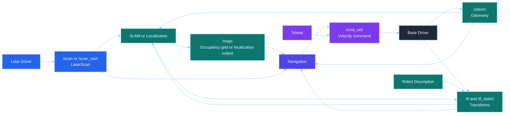
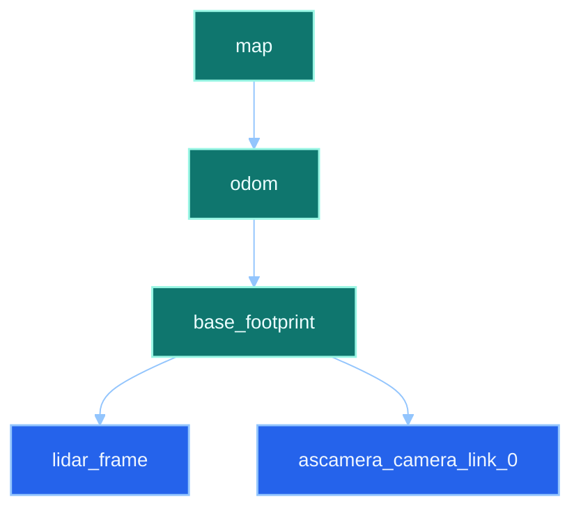

# MentorPi ROS System Architecture

This document is the workspace-level architecture reference for MentorPi ROS 2 packages.

It is intended to help a newcomer build a practical mental model of how MentorPi works end-to-end: hardware drivers produce robot state and sensor data, TF connects those data streams into a shared coordinate story, SLAM and navigation use that shared state to reason about the world, and behavior packages turn goals into visible robot actions.

## 1. High-level view

MentorPi is organized as layered ROS 2 subsystems:

1. hardware and sensors
2. shared interfaces
3. startup and calibration
4. autonomy (SLAM/navigation/multi)
5. application and AI behaviors
6. simulation/description

Typical runtime flow:

1. hardware drivers publish base state and sensors
2. interface packages define shared messages/services
3. bringup launches baseline robot runtime
4. autonomy packages consume state + sensor data
5. app/example/AI packages implement visible behaviors

What this means in practice:

- When you turn the robot on, the lowest layer comes alive first. The base controller, IMU, lidar, camera, and any other attached devices begin publishing ROS messages and TF transforms that describe what the robot senses and where its parts are in space.
- The bringup layer then assembles those publishers into a usable runtime graph. That usually means starting base-state publishers, teleop or input nodes, sensor wrappers, and any launch-time parameterization needed for calibration.
- Once the robot is producing a stable odometry and TF tree, higher-level packages such as SLAM and navigation can attach to that state and start reasoning about the map, localization, and path execution.
- Finally, behavior packages consume those autonomy outputs or raw perception streams and decide what the robot should do next.

What happens when you drive it with a joystick:

1. `joy_node` reads `/dev/input/js0` and publishes `sensor_msgs/Joy`
2. `joystick_control` converts axes to `geometry_msgs/Twist` on `/controller/cmd_vel` (max 0.5 m/s linear, 2.0 rad/s angular)
3. `odom_publisher` applies the mecanum kinematic model and sends `MotorsState` to `ros_robot_controller`
4. `ros_robot_controller` converts motor speeds to PWM via the board SDK; the STM32 drives the motors
5. `odom_publisher` integrates the commanded velocity and publishes raw odometry on `/odom_raw`
6. `ekf_filter_node` fuses `/odom_raw` and `/imu` and publishes the smoothed estimate on `/odom` plus the `odom → base_footprint` TF
7. SLAM, navigation, RViz, and PlotJuggler observe `/odom` and `/tf` to track robot motion

This is the main control loop: commands go down toward the base driver, while state and sensor observations flow up toward localization, planning, and visualization.

### After bringup: what's running

When the robot boots, `systemd` runs `start_node.service`, which calls `start_node.sh`, which runs `ros2 launch bringup bringup.launch.py` inside the Docker container. Three groups of components come up together:

| Group | Purpose | Can crash without stopping chassis? |
|---|---|---|
| **Core** | Motion control, odometry, IMU fusion, EKF, teleop | No — any failure stops the robot |
| **Sensors** | Lidar, depth camera, TF/URDF | Yes — robot still drives, loses perception |
| **Services** | rosbridge (9090), web video (8080), app scenarios | Yes — independent of motion |

Key topics confirmed after a normal bringup:

```
/odom          ← EKF output (used by SLAM + nav)
/odom_raw      ← mecanum kinematics only
/imu           ← complementary-filtered IMU
/scan          ← LaserScan from lidar
/depth_cam/rgb/image_raw  ← HP60C colour frames
/tf            ← odom→base_footprint→lidar_frame→…
```

For the full boot chain, node-by-node table, and per-topic reference see [bringup-reference.md](bringup-reference.md).


```mermaid
%%{init: {'theme': 'base', 'themeVariables': {
  'primaryColor': '#1e293b',
  'primaryTextColor': '#e2e8f0',
  'primaryBorderColor': '#7dd3fc',
  'lineColor': '#93c5fd',
  'secondaryColor': '#0f172a',
  'tertiaryColor': '#111827',
  'background': '#020817',
  'mainBkg': '#0f172a',
  'nodeBorder': '#7dd3fc',
  'clusterBkg': '#0f172a',
  'clusterBorder': '#93c5fd',
  'textColor': '#e2e8f0',
  'fontFamily': 'Arial',
  'fontSize': '14px'
}}}%%
flowchart LR
  classDef robot fill:#1d4ed8,stroke:#7dd3fc,color:#e0f2fe,stroke-width:1.5px;
  classDef data fill:#0f766e,stroke:#99f6e4,color:#ecfeff,stroke-width:1.5px;
  classDef app fill:#7c3aed,stroke:#c4b5fd,color:#f5f3ff,stroke-width:1.5px;
  classDef io fill:#1f2937,stroke:#93c5fd,color:#f8fafc,stroke-width:1.5px;

  subgraph Robot[MentorPi Runtime]
    S[Sensors and Drivers\nlidar, imu, encoders, camera, base controller]
    TF[TF and Robot State\n/tf, /odom, joint state, frame relationships]
    SLAM[SLAM and Localization\nmap building or pose estimation]
    NAV[Navigation\nplanning, costmaps, path following]
    BEH[Behaviors and Apps\nteleop, demos, AI, task logic]
    CMD["/cmd_vel commands"]
    BASE[Base Driver and Motors]
  end

  S --> TF
  TF --> SLAM
  TF --> NAV
  SLAM --> NAV
  BEH --> CMD
  NAV --> CMD
  CMD --> BASE
  BASE --> TF

  RVIZ[RViz]
  PLOT[PlotJuggler]
  CLI[ROS 2 CLI]

  TF -. observe .-> RVIZ
  SLAM -. observe .-> RVIZ
  NAV -. observe .-> RVIZ
  TF -. observe .-> PLOT
  CLI -. inspect topics, nodes, TF .-> Robot

  class S,TF,SLAM,NAV,BASE robot;
  class CMD,BEH app;
  class RVIZ,PLOT,CLI io;
  style Robot fill:#0b1220,stroke:#93c5fd,stroke-width:1.2px,color:#e2e8f0;
```

## Glossary

- `cmd_vel`: the standard ROS velocity-command topic shape, usually a `geometry_msgs/Twist`. It tells the robot how fast to move forward, sideways if supported, and how fast to rotate.
- odometry: the robot's estimate of its own motion over short time spans, often derived from wheel encoders, IMU fusion, or both. Odometry is locally useful but drifts over time.
- TF: the ROS transform system. TF answers questions like "where is the lidar relative to the robot base" or "where is the robot base relative to odom right now."
- `LaserScan`: a common ROS message for 2D lidar ranges, often published on topics such as `/scan` or `/scan_raw`.
- SLAM: simultaneous localization and mapping. A SLAM package estimates the robot pose while building or updating a map.
- Nav2: the ROS 2 navigation stack. It usually handles path planning, costmaps, recovery behavior, and path execution.
- costmap: a grid representation of nearby obstacles and traversability used by planners and controllers.
- `odom` frame: a locally smooth frame used for short-term motion tracking. It should not jump suddenly, but it can drift relative to the world.
- `map` frame: a world-referenced frame used by SLAM or localization. It provides long-term global consistency and may correct drift relative to `odom`.
- `base_link` / `base_footprint`: the frame attached to the robot body. MentorPi uses `base_footprint` as the robot root frame. `odom_publisher` publishes the `odom → base_footprint` TF; `robot_state_publisher` adds all static sensor frames below it.

## 2. Package map

Core package groups in this workspace:

- Hardware layer:
  - `src/MentorPi/driver`
  - `src/MentorPi/peripherals`
  - `src/ascamera`
- Interface layer:
  - `src/MentorPi/interfaces`
  - `src/MentorPi/driver/ros_robot_controller_msgs`
  - `src/MentorPi/large_models_msgs`
- Startup and calibration:
  - `src/MentorPi/bringup`
  - `src/MentorPi/calibration`
- Autonomy:
  - `src/MentorPi/slam`
  - `src/MentorPi/navigation`
  - `src/MentorPi/multi`
- Applications and AI:
  - `src/MentorPi/app`
  - `src/MentorPi/example`
  - `src/MentorPi/large_models`
  - `src/MentorPi/yolov5_ros2`
- Simulation/model:
  - `src/MentorPi/simulations/mentorpi_description`

How to read this package map:

- Hardware layer: these packages touch physical devices or their vendor integrations. In the runtime graph, they are close to the actual robot and usually publish the first useful state and sensor topics.
- Interface layer: these packages define contracts between subsystems. They matter because many runtime dependencies are not direct code imports but shared message and service types.
- Startup and calibration: these packages decide what gets launched together and how the robot is tuned. They often do not publish the most interesting data themselves, but they determine whether the rest of the graph is wired correctly.
- Autonomy: these packages turn raw robot state into higher-level world understanding and goal-directed motion.
- Applications and AI: these packages are where visible behaviors, demos, and task logic usually live.
- Simulation/model: these packages help describe the robot shape, joints, and frames for RViz and simulation workflows.

You can think of the runtime graph as a stack: lower packages publish the facts, middle packages interpret them, and upper packages decide what to do with them.


```mermaid
%%{init: {'theme': 'base', 'themeVariables': {
  'primaryColor': '#1e293b',
  'primaryTextColor': '#e2e8f0',
  'primaryBorderColor': '#7dd3fc',
  'lineColor': '#93c5fd',
  'secondaryColor': '#0f172a',
  'tertiaryColor': '#111827',
  'background': '#020817',
  'mainBkg': '#0f172a',
  'nodeBorder': '#7dd3fc',
  'clusterBkg': '#0f172a',
  'clusterBorder': '#93c5fd',
  'textColor': '#e2e8f0',
  'fontFamily': 'Arial',
  'fontSize': '14px'
}}}%%
flowchart TB
  classDef hw fill:#2563eb,stroke:#93c5fd,color:#eff6ff,stroke-width:1.5px;
  classDef iface fill:#0f766e,stroke:#99f6e4,color:#ecfeff,stroke-width:1.5px;
  classDef start fill:#7c3aed,stroke:#c4b5fd,color:#f5f3ff,stroke-width:1.5px;
  classDef auto fill:#4f46e5,stroke:#a5b4fc,color:#eef2ff,stroke-width:1.5px;
  classDef app fill:#a21caf,stroke:#f0abfc,color:#fdf4ff,stroke-width:1.5px;
  classDef sim fill:#1f2937,stroke:#93c5fd,color:#f8fafc,stroke-width:1.5px;

  HW[Hardware Layer\ndriver, peripherals, ascamera]
  IFACE[Interface Layer\ninterfaces, custom msgs, services]
  START[Startup and Calibration\nbringup, calibration]
  AUTO[Autonomy\nslam, navigation, multi]
  APP[Applications and AI\napp, example, large_models, yolov5_ros2]
  SIM[Simulation and Description\nmentorpi_description]

  IFACE --> HW
  IFACE --> START
  IFACE --> AUTO
  IFACE --> APP
  HW --> START
  START --> AUTO
  START --> APP
  HW --> AUTO
  AUTO --> APP
  SIM -. provides model and frames .-> START
  SIM -. provides model and frames .-> RV[RViz and Simulation]

  class HW,START,AUTO,APP,SIM hw;
  class IFACE iface;
  class RV sim;
```

## 3. Responsibilities by major package

### driver

Low-level robot control and bridge to controller board.

- `controller`: Python-side kinematic and odometry logic (`odom_publisher`, `init_pose`)
- `ros_robot_controller`: UART bridge node to the STM32 board
- `ros_robot_controller_msgs`: custom `MotorsState`, `BuzzerState`, `LedState`, etc.
- `sdk`: board SDK used by `ros_robot_controller`

What it provides:

- `ros_robot_controller` is the UART bridge between ROS 2 and the STM32 board. It reads raw IMU data (accelerometer + gyroscope) from the board and publishes `sensor_msgs/Imu` on `/ros_robot_controller/imu_raw`. In the other direction it receives `MotorsState` commands and converts them to PWM signals via the board SDK. It also drives board peripherals: LEDs, buzzer, OLED display, servos.
- `odom_publisher` computes odometry from the mecanum kinematic model (wheelbase 136.8 mm, track width 144.6 mm, wheel diameter 65 mm). It integrates velocity commands every 20 ms and publishes `nav_msgs/Odometry` on `/odom_raw` at 50 Hz.
- `ekf_filter_node` (`robot_localization` package) fuses `/odom_raw` and `/imu` into a single state estimate and publishes the result on `/odom`. It also broadcasts the `odom → base_footprint` transform on `/tf`.
- `init_pose` reads `config/init_pose.yaml` and `/home/ubuntu/software/Servo_upper_computer/servo_config.yaml`, computes final PWM positions (`pulse + offset + 1500`) for servo ids 1–4, and publishes `SetPWMServoState` on `ros_robot_controller/pwm_servo/set_state` to move the camera mount and other servos to their home position. It also advertises `~/init_finish` so `startup_check` can confirm the node is ready.

Confirmed nodes, topics, and interfaces:

| Node | Subscribes | Publishes |
|---|---|---|
| `ros_robot_controller` | `ros_robot_controller/set_motor` (`MotorsState`) | `/ros_robot_controller/imu_raw` (`Imu`) |
| `odom_publisher` | `controller/cmd_vel` (`Twist`) | `/odom_raw` (`Odometry`) |
| `ekf_filter_node` | `/odom_raw`, `/imu` | `/odom` (`Odometry`), `odom→base_footprint` TF |
| `init_pose` | — | `ros_robot_controller/pwm_servo/set_state` (`SetPWMServoState`) |

How it connects to other packages:

- `bringup` launches the full driver stack via `controller.launch.py`.
- `navigation`, `app`, and teleop flows send `Twist` on `/controller/cmd_vel` → `odom_publisher` → `MotorsState` → `ros_robot_controller`.
- `/odom` from `ekf_filter_node` is the primary odometry input for SLAM and navigation.

How to verify:

- `ros2 topic hz /odom_raw` — should update at ~50 Hz while the robot is powered.
- `ros2 topic echo /ros_robot_controller/imu_raw` — should show gyro and accelerometer data.
- `ros2 topic echo /odom` — values should change when the robot moves.
- In PlotJuggler, plot `/odom/pose/pose/position/x` and `y` while driving a square.

### peripherals

External devices and operator input.

- joystick teleop (`joy_node` + `joystick_control`)
- IMU calibration and filtering (`imu_calib`, `imu_filter`)
- lidar driver wrapper (MS200 or LD19, selected by `$LIDAR_TYPE`)
- depth camera wrapper (delegates to `ascamera` or USB cam)

What it provides:

- **Joystick**: `joy_node` reads `/dev/input/js0` at 20 Hz and publishes `sensor_msgs/Joy`. `joystick_control` maps axes to linear (max 0.5 m/s) and angular (max 2.0 rad/s) velocity and publishes `geometry_msgs/Twist` on `/controller/cmd_vel`.
- **IMU pipeline**: `imu_calib` applies calibration offsets from `calibration/config/imu_calib.yaml` to `/ros_robot_controller/imu_raw` → `/imu_corrected`. `imu_filter` (complementary filter, launched with a 5-second delay) fuses accelerometer and gyroscope and publishes `sensor_msgs/Imu` on `/imu`.
- **Lidar**: wraps the vendor driver (MS200 or LD19) and publishes `sensor_msgs/LaserScan` on `/scan` with `frame_id: lidar_frame`. The lidar type is selected at runtime via the `$LIDAR_TYPE` environment variable.
- **Depth camera**: delegates to the `ascamera` launch or a USB-cam fallback depending on `$DEPTH_CAMERA_TYPE`.

Confirmed topics:

| Node | Publishes |
|---|---|
| `joy_node` | `sensor_msgs/Joy` |
| `joystick_control` | `/controller/cmd_vel` (`Twist`, max 0.5 m/s / 2.0 rad/s) |
| `imu_calib` | `/imu_corrected` (`Imu`) |
| `imu_filter` | `/imu` (`Imu`) |
| lidar driver | `/scan` (`LaserScan`, `frame_id: lidar_frame`) |

How it connects to other packages:

- `/controller/cmd_vel` feeds `odom_publisher` in `driver`, which converts it to per-wheel speeds.
- `/imu` feeds `ekf_filter_node` in `driver`.
- `/scan` is the primary input for SLAM and navigation costmaps.

How to verify:

- `ros2 topic hz /scan` — should show ~10–15 Hz for the lidar.
- `ros2 topic echo /imu` — should show orientation changes when the robot rotates.
- `ros2 topic echo /controller/cmd_vel` while pressing a joystick axis.

### ascamera

Vendor depth-camera package (Ascamera/HP60 family).

- C++ node (`ascamera_node`) and per-model launch files
- vendor libraries in `libs/`
- per-model JSON configuration files in `configurationfiles/`

What it provides:

- `ascamera_node` opens the HP60C over USB using the vendor SDK, reads colour and depth frames, and publishes them as ROS topics. It is the most hardware-specific perception node in this workspace.

Confirmed topics and frames (HP60C model via `hp60c.launch.py`):

| Topic | Type |
|---|---|
| `/depth_cam/rgb/image_raw` | `sensor_msgs/Image` |
| `/depth_cam/depth/image_raw` | `sensor_msgs/Image` |
| `/depth_cam/rgb/camera_info` | `sensor_msgs/CameraInfo` |
| `/depth_cam/depth/camera_info` | `sensor_msgs/CameraInfo` |

TF frame: `ascamera_camera_link_0`. A static transform `ascamera_camera_link_0 → base_footprint` is published so camera data is expressed in the robot body frame.

How it connects to other packages:

- `peripherals/depth_camera.launch.py` wraps this node when `$DEPTH_CAMERA_TYPE=ascamera`.
- `app`, `yolov5_ros2`, and `large_models` consume the image topics.
- `web_video_server` in the Services group streams `/depth_cam/rgb/image_raw` over HTTP.

How to verify:

- `ros2 topic hz /depth_cam/rgb/image_raw` — should show the camera frame rate.
- `ros2 topic echo /depth_cam/rgb/camera_info` — confirms calibration is loaded.
- In RViz, add an Image display subscribed to `/depth_cam/rgb/image_raw`.

### bringup

System startup composition and baseline runtime orchestration.

`bringup.launch.py` is the single entry point launched by `start_node.sh` inside the Docker container. It includes three launch groups: Core (motion + state), Sensors (lidar, camera, TF), and Services (rosbridge, web video, app scenarios). See [bringup-reference.md](bringup-reference.md) for the full boot chain, bringup fan-out diagram, node reference table, and minimum topic set.

How it connects to other packages:

- Depends on `driver`, `peripherals`, `ascamera`, and `app`; produces the stable topic graph that `slam`, `navigation`, and external tools assume exists.

How to verify:

- `ros2 node list | grep -E "ros_robot_controller|odom_publisher|ekf_filter|ascamera|startup_check"` — all should appear.
- `ros2 topic list` should include `/odom`, `/odom_raw`, `/imu`, `/scan`, `/depth_cam/rgb/image_raw`.
- In RViz, TF should show: `odom → base_footprint → lidar_frame` and `base_footprint → ascamera_camera_link_0`.

### calibration

Calibration and tuning tools for mecanum kinematics and IMU.

The IMU calibration config is at `calibration/config/imu_calib.yaml` and is consumed by `imu_calib` at runtime. Better calibration directly improves the accuracy of SLAM, navigation, and teleop.

How to verify: drive a straight line or rotate in place and compare commanded versus observed movement; plot `/odom_raw` and `/imu` to check for obvious scaling or bias.

### slam

Mapping and localization, with RViz helpers.

Consumes `/scan`, `/odom`, and TF from the base stack; produces the `/map` topic and the `map → odom` transform. The `map → odom` link corrects odometry drift without forcing the `odom` frame to jump. SLAM must be healthy before navigation can plan globally.

How to verify in RViz: set Fixed Frame to `odom`, add Map + TF + LaserScan. Drive the robot and confirm the map builds without visible drift.

### navigation

Goal-driven autonomous navigation (Nav2-style).

Consumes `/map`, `/odom`, `/scan`, and TF; outputs `/cmd_vel` to the same base driver path used by teleop. Navigation sits above the driver and TF — if the base stack is unhealthy, planning fails even if the navigation nodes are running.

How to verify: send a goal in RViz and confirm a path appears; check `/cmd_vel` is active while the robot moves. If planning fails, verify `/map`, `/odom`, `/tf`, and `/scan` are all alive first.

### multi

Multi-robot coordination, namespaced TF and follower workflows.

Layers namespace and coordination logic on top of the standard single-robot bringup. Each robot instance needs distinct topic and TF namespaces to avoid collisions. Verify with `ros2 topic list` and RViz that frames and topics are properly separated per robot.

### app/example

Task-level behaviors and demos.

The highest-level packages in the stack. Behavior nodes subscribe to sensor, navigation, or detection outputs and publish `/cmd_vel` or call control services. All required inputs (driver, sensors, SLAM/nav if needed) must be confirmed healthy before debugging behavior logic.

### large_models and large_models_msgs

AI-driven behaviors and their message contracts.

`large_models_msgs` defines custom message and service types shared across AI behaviors; `large_models` contains the behavior nodes. Build `large_models_msgs` before any dependent package. Verify with `ros2 interface list` that types are sourced correctly after rebuilding.

### yolov5_ros2

Object-detection pipeline integrated as a ROS node.

Subscribes to camera image topics from `peripherals` / `ascamera`; publishes detection results consumed by `app` or AI behaviors. If detections are missing, verify the camera image topic is alive at the expected frame rate before debugging the detection model.

### mentorpi_description

URDF robot model for RViz and simulation.

Provides the geometry, links, and joints that `robot_state_publisher` uses to publish static TF transforms. Without this, the TF tree below `base_footprint` is incomplete and RViz cannot render the robot model. Verify in RViz that the model aligns with scan and camera data.

### TF and topic flow mental model

TF is one of the most important ROS concepts for mobile robots, because it lets every subsystem speak about position using the same frame relationships.

- A lidar scan is only useful for SLAM or navigation if the system knows where the lidar is mounted.
- Odometry is only useful globally if the system knows how that short-term local motion estimate relates to the world map.
- Navigation can only generate safe commands if it can transform robot pose, obstacle data, and goals into compatible frames.


```mermaid
%%{init: {'theme': 'base', 'themeVariables': {
  'primaryColor': '#1e293b',
  'primaryTextColor': '#e2e8f0',
  'primaryBorderColor': '#7dd3fc',
  'lineColor': '#93c5fd',
  'secondaryColor': '#0f172a',
  'tertiaryColor': '#111827',
  'background': '#020817',
  'mainBkg': '#0f172a',
  'nodeBorder': '#7dd3fc',
  'clusterBkg': '#0f172a',
  'clusterBorder': '#93c5fd',
  'textColor': '#e2e8f0',
  'fontFamily': 'Arial',
  'fontSize': '14px'
}}}%%
flowchart LR
  classDef sensor fill:#2563eb,stroke:#93c5fd,color:#eff6ff,stroke-width:1.5px;
  classDef state fill:#0f766e,stroke:#99f6e4,color:#ecfeff,stroke-width:1.5px;
  classDef nav fill:#4f46e5,stroke:#a5b4fc,color:#eef2ff,stroke-width:1.5px;
  classDef cmd fill:#7c3aed,stroke:#c4b5fd,color:#f5f3ff,stroke-width:1.5px;
  classDef tool fill:#1f2937,stroke:#93c5fd,color:#f8fafc,stroke-width:1.5px;
  SCAN["/scan or /scan_raw\\nLaserScan"]
  ODOM["/odom\\nOdometry"]
  TF["/tf and /tf_static\\nTransforms"]
  MAP["/map\\nOccupancy grid or localization output"]
  CMD["/cmd_vel\\nVelocity command"]

  LIDAR[Lidar Driver] --> SCAN
  BASEDRV[Base Driver] --> ODOM
  BASEDRV --> TF
  ROBOTDESC[Robot Description] --> TF
  SCAN --> SLAM2[SLAM or Localization]
  ODOM --> SLAM2
  TF --> SLAM2
  SLAM2 --> MAP
  SLAM2 --> TF
  MAP --> NAV2[Navigation]
  ODOM --> NAV2
  TF --> NAV2
  SCAN --> NAV2
  NAV2 --> CMD
  TELEOP[Teleop] --> CMD
  CMD --> BASEDRV

  class SCAN,LIDAR sensor;
  class ODOM,TF,MAP,ROBOTDESC,SLAM2 state;
  class NAV2 nav;
  class CMD,TELEOP cmd;
  class BASEDRV tool;
```

The exact names above may differ on your robot. The point of the diagram is conceptual: identify the scan source, odometry source, TF publishers, map producer, and command consumer, then verify that the data dependencies are connected on the live system.


```mermaid
%%{init: {'theme': 'base', 'themeVariables': {
  'primaryColor': '#1e293b',
  'primaryTextColor': '#e2e8f0',
  'primaryBorderColor': '#7dd3fc',
  'lineColor': '#93c5fd',
  'secondaryColor': '#0f172a',
  'tertiaryColor': '#111827',
  'background': '#020817',
  'mainBkg': '#0f172a',
  'nodeBorder': '#7dd3fc',
  'clusterBkg': '#0f172a',
  'clusterBorder': '#93c5fd',
  'textColor': '#e2e8f0',
  'fontFamily': 'Arial',
  'fontSize': '14px'
}}}%%
flowchart TB
  classDef frame fill:#0f766e,stroke:#99f6e4,color:#ecfeff,stroke-width:1.5px;
  classDef sensor fill:#2563eb,stroke:#93c5fd,color:#eff6ff,stroke-width:1.5px;

  MAPF[map]
  ODOMF[odom]
  BASEF[base_footprint]
  LIDARF[lidar_frame]
  CAMF[ascamera_camera_link_0]

  MAPF --> ODOMF
  ODOMF --> BASEF
  BASEF --> LIDARF
  BASEF --> CAMF

  class MAPF,ODOMF,BASEF frame;
  class LIDARF,CAMF sensor;
```

This TF diagram uses confirmed MentorPi frame IDs. What matters is the role of each link:

- `map → odom`: global correction published by SLAM or localization
- `odom → base_footprint`: continuous local motion estimate from `ekf_filter_node`
- `base_footprint → lidar_frame` / `ascamera_camera_link_0`: static sensor mounts from `robot_state_publisher`

## 4. Integration patterns

Common system compositions:

1. base robot operation:
   - `bringup` + `driver` + `peripherals`
2. perception + behavior:
   - `peripherals` or `ascamera` + `app`/`example`/`yolov5_ros2`
3. autonomy:
   - `calibration` -> `slam` -> `navigation`
4. multi-robot:
   - baseline stack + `multi`

What to launch, what to expect, and how to verify:

1. base robot operation:
  - Runtime idea: start `bringup` with the core `driver` and `peripherals` stack.
  - What to expect: the robot should expose base state, TF, and operator-control paths even if SLAM and navigation are not running.
  - How to verify: confirm that expected nodes are present, `odom` is updating, and the TF tree connects the base to the active sensors. Use RViz for TF and PlotJuggler for odometry trends.
2. perception + behavior:
  - Runtime idea: launch the relevant sensor source first, then launch the consumer behavior or perception package.
  - What to expect: image or scan topics should appear before the higher-level app produces useful behavior.
  - How to verify: check sensor topic rates with `ros2 topic hz`, inspect the topic graph, and confirm the consuming node is subscribed to the expected inputs.
3. autonomy:
  - Runtime idea: calibrate enough that odometry is trustworthy, then start `slam`, then start `navigation` once map and TF look healthy.
  - What to expect: the robot should publish a map or localization result, expose a consistent `map -> odom -> base_link` chain, and begin accepting navigation goals.
  - How to verify: use RViz to display TF, scan, pose, and map together. If the map slides, scan floats away from the robot, or the goal pose behaves strangely, debug TF and odometry before blaming the planner.
4. multi-robot:
  - Runtime idea: start one clean single-robot stack first, then add `multi` coordination and namespacing.
  - What to expect: each robot should retain its own state, topics, and frame relationships without naming collisions.
  - How to verify: use `ros2 topic list` and RViz to confirm namespace separation and distinct TF trees or prefixed frames.

What this means for SLAM and navigation composition:

- SLAM answers: "Where am I, and what does the world look like?"
- Navigation answers: "Given where I am and where I want to go, what path and control command should I execute?"
- Both depend on lower layers being healthy. If the base driver, odometry, or sensor TF is broken, SLAM and navigation may both fail even though their own nodes are technically running.

## 5. Hardware dependency categories

- Mostly hardware-required:
  - `driver`, `bringup`, many `app` and motion-centric examples
- Hardware-optional with substitutions:
  - `peripherals` camera flows via USB webcam
  - selected image-only `example` nodes
  - `yolov5_ros2` on webcam/image topics
- PC-only friendly:
  - `mentorpi_description` visualization
  - ROS graph/topic debugging

What can be done in Docker or on an external PC without the robot:

- You can read the code, inspect launch structure, build interface packages, review message definitions, and prepare RViz or analysis workflows.
- You can often run visualization-oriented pieces such as robot description displays, provided the needed ROS packages are installed locally.
- You can attach to a live robot remotely from another PC to inspect topics, TF, maps, and timing without running the heavy GUI tools directly on the robot.

What usually cannot be validated without real hardware or a live publisher:

- Base motion accuracy, real odometry quality, lidar scan health, IMU behavior, and camera-driver correctness all depend on actual devices or a high-fidelity simulator.
- Any package whose main job is to convert real sensor or controller traffic into ROS messages is only partially testable without the matching hardware.

Practical rule:

- If the package controls motors or wraps a physical sensor, expect only partial confidence without the robot.
- If the package consumes already-published ROS topics, an external PC or Docker workflow is often enough to inspect and debug it.

## 6. Development recommendation

When adding new functionality, place it in the highest valid layer:

- hardware specifics in driver/peripherals/ascamera
- cross-package messages in interfaces packages
- behavior logic in app/example
- autonomy logic in slam/navigation/multi

This keeps dependencies clean and helps maintain testability without full robot hardware.

Concrete examples:

- A new teleop input node that converts a custom joystick or web UI into velocity commands belongs in `peripherals` if it is mainly an input/device integration.
- A new perception pipeline that consumes camera images and publishes detections belongs in `app`, `example`, or a perception-focused package, while any new reusable message definitions belong in an interface package.
- A new map-aware behavior such as "drive to docking pose" belongs above raw navigation, usually in `app` or another behavior package, unless it changes the planner or controller itself.
- A new multi-robot follower strategy belongs in `multi` because it depends on namespaced robot relationships rather than single-robot hardware access.

Design rule of thumb:

- Put hardware-specific code as low as possible.
- Put reusable contracts in interfaces.
- Put user-visible decisions and task logic as high as possible.

That separation makes it easier to test parts of the system independently and easier to observe problems from an external PC.

## 7. Validation checklist (external PC)

Use this as a quick live-system checklist for any remote debugging session. For the full topic reference see [bringup-reference.md](bringup-reference.md).

**Preconditions:** robot and laptop on the same network; `ROS_DOMAIN_ID` matching on both; `ROS_LOCALHOST_ONLY=0`.

**Step 1 — Discovery**

```bash
ros2 node list
ros2 topic list
```

Expect: `ros_robot_controller`, `odom_publisher`, `ekf_filter_node`, `joy_node`, `joystick_control`, `ascamera_node`, `startup_check`.

**Step 2 — Sensor sanity**

```bash
ros2 topic hz /scan          # expect 10–15 Hz
ros2 topic hz /odom_raw      # expect ~50 Hz
ros2 topic hz /odom          # expect ~50 Hz
ros2 topic echo /imu --once  # expect orientation data
```

**Step 3 — TF and robot model (RViz)**

- Fixed Frame: `odom`
- Add: **TF**, **RobotModel** (`/robot_description`), **LaserScan** (`/scan`, size 0.03)
- Confirm TF chain: `odom → base_footprint → lidar_frame → ascamera_camera_link_0`
- Confirm scan points surround the robot model correctly

**Step 4 — Motion and odometry (PlotJuggler)**

Plot these three groups while driving to see the full estimation pipeline:

| Group | Signal | What it shows |
|---|---|---|
| Raw | `/ros_robot_controller/imu_raw/angular_velocity/z` | Noisy gyro from STM32 |
| Raw | `/odom_raw/twist/twist/linear/x` | Kinematics before fusion |
| Filtered | `/imu/angular_velocity/z` | After complementary filter |
| Final | `/odom/pose/pose/position/x`, `.../y` | EKF output used by SLAM |

**Step 5 — Camera stream**

```
http://<robot-ip>:8080/stream?topic=/depth_cam/rgb/image_raw
```

Open in a browser (no ROS required on the client).

**Step 6 — Mapping and navigation**

- In RViz, add Map (`/map`) and confirm it updates while driving.
- If navigation is active, confirm that goals produce planned paths and `/cmd_vel` is publishing.

**Step 7 — If something is wrong: bottom-up debug order**

1. Verify Core topics and TF (`/odom`, `/tf`, `ros_robot_controller` responsive)
2. Verify Sensor topics (`/scan` rate, `/depth_cam` rate)
3. Verify `slam` or localization output (`/map`, `map→odom` TF)
4. Only then debug `navigation` or higher-level behaviors

This order matches the dependency chain and finds root causes faster than starting at the top.